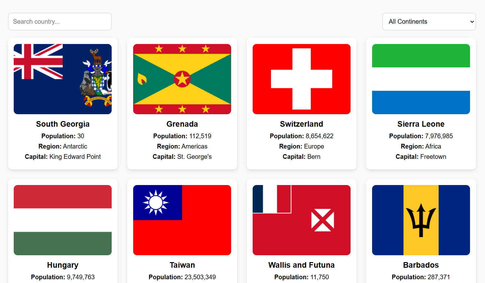

# 🌍 Country Details App

A responsive ReactJS web application that displays information about countries around the world using data fetched from a REST API.

---

## ✨ Features

- 🗃️ Displays all countries in a card format with flag icons  
- 🔍 Live search box to filter countries by name  
- 🌐 Dropdown to filter countries by continent or view all  
- 🧭 Click on a country card to navigate to a detailed view page  
- 📄 Country details include:
  - Flag
  - Native Name
  - Top Level Domain
  - Population
  - Region
  - Capital
  - Currency
  - Languages
  - Bordering Countries (with link)

---

## 🖼️ Demo

---

## 🛠️ Tech Stack

- **ReactJS**  
- **React Router** (for navigation)  
- **CSS / SCSS** (for styling)  
- **REST Countries API** for data:  
  [API Link](https://restcountries.com/v3.1/all)

---
## 🧭 Navigation

- On the homepage, you can scroll through countries or use the search box or continent filter.

- Click on any country card to navigate to a dedicated detail page showing full country information.

---

## 🖼️ Example Country Details

- Montenegro 🇲🇪

- Native Name: Црна Гора

- Top Level Domain: .me

- Population: 621,718

- Region: Europe

- Capital: Podgorica

- Currency: Euro

- Languages: Montenegrin

- Borders: ALB, BIH, HRV, UNK, SRB

---
